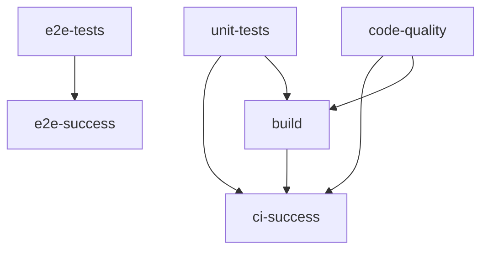

# GitHub Workflows Documentation

## Overview

This project uses a **multi-job CI strategy** that separates concerns and optimizes for speed and reliability.

## Workflow Structure

### 🚀 Jobs Overview



### 1. **unit-tests** (Fast, Every Commit)
- **Trigger**: Every push and PR
- **Duration**: ~30 seconds
- **Purpose**: Fast feedback with unit tests
- **Commands**:
  - `make test-unit` - Run unit tests with TestClient
  - `make test-coverage` - Generate coverage report (PRs only)

### 2. **e2e-tests** (Thorough, PRs + Main)
- **Trigger**: PRs and master branch pushes
- **Duration**: ~2 minutes
- **Purpose**: End-to-end validation with real server
- **Commands**:
  - `make test-e2e` - Self-contained server tests

### 3. **code-quality** (Standards, Every Commit)
- **Trigger**: Every push and PR
- **Duration**: ~1 minute
- **Purpose**: Linting, formatting, type checking
- **Commands**:
  - `ruff check .` - Python linting
  - `mypy server/ domains/ shared/` - Backend type checking
  - `pre-commit run --all-files` - Formatting and meta checks
  - `pnpm run lint` - Frontend linting
  - `pnpm run type-check` - TypeScript checking

### 4. **build** (Verification, Every Commit)
- **Trigger**: Every push and PR (after unit tests pass)
- **Duration**: ~1 minute
- **Purpose**: Verify builds work
- **Commands**:
  - Backend: Verify server starts
  - Frontend: `pnpm run build`

## Execution Strategy

### **On Push to Master:**
```
unit-tests ──┬── build ── ci-success
code-quality ─┘
e2e-tests ───────── e2e-success
```

### **On Pull Request:**
```
unit-tests ──┬── build ── ci-success
code-quality ─┘    │
e2e-tests ──────────┼── e2e-success
                    │
              Coverage Reports
```

## Key Features

### ✅ **Optimized for Speed**
- **Unit tests** run first (fastest feedback)
- **E2E tests** only on PRs/main (when needed)
- **Parallel execution** where possible

### ✅ **Self-Contained**
- **No manual server setup** required
- **Dynamic port allocation** prevents conflicts
- **Automatic cleanup** after tests

### ✅ **Comprehensive Coverage**
- **Unit tests**: Fast validation of logic
- **E2E tests**: Full workflow validation
- **Code quality**: Standards enforcement
- **Build verification**: Deployment readiness

### ✅ **Developer Friendly**
- **Clear job names** and status
- **Coverage reports** on PRs
- **Build artifacts** for debugging
- **Detailed failure reporting**

## Environment Variables

```yaml
env:
  PYTHON_VERSION: '3.13'    # Python version for all jobs
  NODE_VERSION: '18'        # Node.js version for frontend
```

## Make Commands Used

| Command | Purpose | Used In |
|---------|---------|---------|
| `make test-unit` | Fast unit tests | unit-tests job |
| `make test-e2e` | Self-contained E2E | e2e-tests job |
| `make test-coverage` | Unit tests + coverage | unit-tests (PRs) |

## Success Criteria

### **Required for Merge:**
- ✅ Unit tests pass
- ✅ Code quality checks pass
- ✅ Build verification passes
- ✅ E2E tests pass (if running)

### **Optional Features:**
- 📊 Coverage reports (PRs only)
- 📦 Build artifacts (master only)
- 🔍 Type checking (best effort)

## Failure Handling

### **Fast Failure:**
- Unit tests fail → Stop immediately
- Code quality fails → Stop immediately
- Build fails → Stop immediately

### **Clear Reporting:**
- Each job reports its status
- Summary jobs aggregate results
- Detailed logs for debugging

## Local Development

Developers can run the same commands locally:

```bash
# Same as CI unit tests
make test-unit

# Same as CI E2E tests
make test-e2e

# Same as CI coverage
make test-coverage

# Pre-commit checks
uv run pre-commit run --all-files
```

## Artifacts

### **On Pull Requests:**
- 📊 HTML coverage reports
- 🧪 Test results

### **On Master Branch:**
- 📦 Build artifacts (frontend dist)
- 📊 Coverage reports
- 🏗️ Server build verification

## Benefits

### **For Developers:**
- ⚡ **Fast feedback** from unit tests
- 🛡️ **Thorough validation** from E2E tests
- 🔍 **Clear failure messages**
- 📊 **Coverage insights**

### **For Maintainers:**
- 🚀 **Reliable deployments**
- 📈 **Quality metrics**
- 🔒 **Consistent standards**
- 🛠️ **Easy debugging**

---

**Result:** A robust, fast, and maintainable CI pipeline that scales with the project! 🎉
