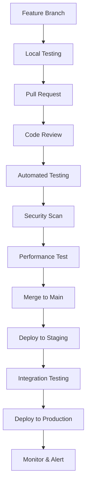

# Conversational State Engine - 项目演化战略

**文档类型:** 架构演化指南  
**架构师:** Claude (资深架构师)  
**创建日期:** 2025-08-19  
**适用阶段:** MVP → 生产级产品  

## 长远目标与技术愿景

### 5年技术愿景
构建**世界级的对话式状态管理平台**，成为企业数字化转型的核心基础设施：

- **技术领导力**: 对话驱动架构的行业标杆，AI-first的状态管理范式
- **平台化能力**: 支持1000+企业客户，10万+并发用户的云原生平台
- **生态系统**: 完整的开发者生态，包含SDK、插件市场、集成平台
- **商业价值**: 年收入1亿+，成为企业级SaaS的重要品类

### 3年战略目标
- **产品成熟度**: 生产级稳定性（99.9%可用性），企业级安全认证
- **市场地位**: 对话式状态管理领域前3，标杆客户50+
- **技术能力**: 多模态交互、实时协作、智能推荐、自动化运维
- **团队规模**: 核心技术团队50人，年度技术投入5000万+

### 1年里程碑目标
- **Q1**: 完成MVP稳定化，支持100+并发用户
- **Q2**: 实现企业级功能，获得首批付费客户
- **Q3**: 平台化改造，支持多租户和API生态
- **Q4**: 国际化部署，进入海外市场

## 系统边界与架构围栏机制

### 核心架构原则
**简化复杂性，明确职责边界，建立围栏保护**

#### 1. 领域边界划分 (Domain Boundaries)
```
┌─────────────────────────────────────────────┐
│                CSE Platform                 │
├─────────────┬─────────────┬─────────────────┤
│ Dialogue    │ State       │ Rendering       │
│ Domain      │ Domain      │ Domain          │
│ ┌─────────┐ │ ┌─────────┐ │ ┌─────────────┐ │
│ │Analyzer │ │ │Manager  │ │ │Incremental  │ │
│ │Commands │ │ │Patches  │ │ │Templates    │ │
│ │Intents  │ │ │Conflicts│ │ │Artifacts    │ │
│ └─────────┘ │ └─────────┘ │ └─────────────┘ │
├─────────────┼─────────────┼─────────────────┤
│ Security    │ Integration │ Platform        │
│ Domain      │ Domain      │ Domain          │
│ ┌─────────┐ │ ┌─────────┐ │ ┌─────────────┐ │
│ │Auth     │ │ │API      │ │ │Multi-tenant │ │
│ │RBAC     │ │ │Webhooks │ │ │Scaling      │ │
│ │Audit    │ │ │SDK      │ │ │Monitoring   │ │
│ └─────────┘ │ └─────────┘ │ └─────────────┘ │
└─────────────┴─────────────┴─────────────────┘
```

#### 2. 技术围栏机制 (Technical Guardrails)
- **数据围栏**: 严格的数据模型验证，防止跨域数据泄露
- **API围栏**: 统一的API网关，强制认证、授权、限流
- **代码围栏**: 模块化架构，禁止跨域直接调用
- **部署围栏**: 容器化隔离，环境配置标准化

#### 3. 认知负担控制策略
- **Single Responsibility**: 每个模块只解决一个核心问题
- **Fail Fast**: 早期发现问题，快速失败机制
- **Convention over Configuration**: 约定优于配置，减少决策疲劳
- **Progressive Disclosure**: 渐进式复杂度暴露，新人友好

### 架构决策记录 (ADR) 框架
建立标准化决策记录，避免重复讨论：

#### ADR-001: API设计规范
- **状态**: 已采用
- **决策**: 采用RESTful + GraphQL混合API架构
- **原因**: REST适合CRUD，GraphQL适合复杂查询
- **约束**: 所有API必须符合OpenAPI 3.0规范

#### ADR-002: 状态管理模式
- **状态**: 已采用  
- **决策**: 采用Event Sourcing + CQRS模式
- **原因**: 支持完整审计轨迹和复杂查询优化
- **约束**: 所有状态变更必须通过事件记录

#### ADR-003: 前端架构模式
- **状态**: 已采用
- **决策**: 采用微前端 + 组件库架构
- **原因**: 支持团队独立开发和部署
- **约束**: 组件必须符合设计系统规范

## 代码规范与质量门控

### 代码组织规范
```
conversational-state-engine/
├── domains/                    # 领域模块
│   ├── dialogue/              # 对话处理领域
│   │   ├── analyzer/          # 意图分析
│   │   ├── commands/          # 命令解析  
│   │   └── validation/        # 输入验证
│   ├── state/                 # 状态管理领域
│   │   ├── manager/           # 状态管理器
│   │   ├── patches/           # 补丁处理
│   │   └── conflicts/         # 冲突检测
│   └── rendering/             # 渲染领域
│       ├── incremental/       # 增量渲染
│       ├── templates/         # 模板引擎
│       └── artifacts/         # 文档生成
├── shared/                    # 共享基础设施
│   ├── auth/                  # 认证授权
│   ├── database/              # 数据访问层
│   ├── monitoring/            # 监控日志
│   └── utils/                 # 工具函数
├── api/                       # API层
│   ├── rest/                  # REST endpoints
│   ├── graphql/               # GraphQL resolvers
│   └── websocket/             # 实时通信
├── web/                       # 前端应用
│   ├── packages/              # 微前端包
│   ├── components/            # 共享组件库
│   └── apps/                  # 应用入口
└── infrastructure/            # 基础设施代码
    ├── docker/                # 容器配置
    ├── kubernetes/            # K8s部署
    └── terraform/             # 云资源
```

### 质量门控机制
#### 代码提交门控
- **静态分析**: mypy, pylint, ESLint 零错误
- **测试覆盖**: 单元测试>80%, 集成测试>70%
- **安全扫描**: Bandit, Semgrep 零高危漏洞
- **性能测试**: 关键路径响应时间<目标值

#### 部署发布门控  
- **集成测试**: 端到端测试套件100%通过
- **性能基准**: 核心指标不能退化>5%
- **安全验证**: 依赖漏洞扫描通过
- **文档更新**: API文档和用户指南同步更新

### 开发工作流规范


## 短期可执行任务 (接下来4周)

### Task 1: 建立项目基础设施和规范
**目标**: 建立开发者生产力基础和质量保障体系  
**工期**: 1周  
**负责人**: DevOps工程师 + 技术负责人  

#### 具体交付物
1. **代码规范工具链配置**
   - 配置pre-commit hooks (black, isort, mypy, eslint)
   - 设置CI/CD pipeline (GitHub Actions)
   - 建立代码审查模板和checklist

2. **项目结构重组**
   - 按领域边界重新组织代码目录
   - 建立shared模块和工具函数
   - 更新import路径和依赖关系

3. **开发环境标准化**  
   - 统一开发环境配置 (Docker Compose)
   - 建立本地测试数据和种子脚本
   - 文档化环境设置和故障排除

**成功标准**:
- [ ] 所有开发者能在30分钟内完成环境搭建
- [ ] CI/CD pipeline绿色通过率>95%
- [ ] 代码质量门控自动执行，零人工干预

**风险缓解**:
- 准备回滚脚本，避免影响现有开发
- 分步骤迁移，先建立新结构再迁移代码
- 建立迁移指南，帮助团队适应新流程

### Task 2: 修复关键安全漏洞和配置问题
**目标**: 消除生产环境安全风险，建立安全基线  
**工期**: 1周  
**负责人**: 安全工程师 + 后端工程师  

#### 具体交付物
1. **配置外化和密钥管理**
   - 将所有敏感配置移至环境变量
   - 实现配置验证和默认值管理
   - 建立开发/测试/生产环境配置模板

2. **安全策略实施**
   - 修复CORS配置，实施白名单机制
   - 启用数据库外键约束和WAL模式
   - 添加基础安全headers和HTTPS重定向

3. **审计日志框架**
   - 实现结构化日志记录
   - 添加安全事件审计 (登录、权限变更、敏感操作)
   - 建立日志轮转和存储策略

**成功标准**:
- [ ] 安全扫描工具零高危漏洞
- [ ] 所有敏感配置从代码中移除
- [ ] 审计日志覆盖100%安全关键操作

**交接文档**:
- 安全配置检查清单
- 环境变量配置指南  
- 安全事件响应流程

### Task 3: 统一API契约和实现一致性
**目标**: 消除前后端集成障碍，建立可靠的API契约  
**工期**: 1.5周  
**负责人**: 全栈工程师 + API架构师  

#### 具体交付物
1. **API契约统一**
   - 决定渐进式确认API模式 (推荐统一单端点)
   - 更新OpenAPI规范包含所有实际端点
   - 实现契约测试，确保规范与实现匹配

2. **错误处理标准化**  
   - 实现统一错误响应格式 (包含correlation_id)
   - 添加全局异常处理中间件
   - 建立错误码字典和本地化支持

3. **API客户端生成**
   - 自动生成TypeScript客户端库
   - 建立API版本管理和向后兼容策略
   - 创建API使用示例和集成测试

**成功标准**:
- [ ] OpenAPI规范与实现100%匹配
- [ ] 自动化契约测试通过率100%  
- [ ] 前端可无缝调用所有后端API

**技术约束**:
- 保持向后兼容，不破坏现有客户端
- API响应时间不能退化>10%
- 遵循RESTful设计原则和HTTP标准

### Task 4: 完成渐进式确认前后端集成
**目标**: 实现完整的3阶段确认用户体验  
**工期**: 2周  
**负责人**: 前端工程师 + 后端工程师  

#### 具体交付物
1. **前端状态机实现**
   - 完善useConfirmationFlow hook的状态管理
   - 实现意图→变更→副作用的完整UI流程
   - 添加取消、回退、重试等用户交互

2. **后端确认逻辑完善**
   - 统一确认端点的参数验证和状态检查
   - 实现确认状态持久化和恢复
   - 添加确认超时和清理机制

3. **集成测试覆盖**
   - 编写端到端确认流程测试
   - 添加错误场景和边缘情况测试
   - 实现性能测试，确保流程响应及时

**成功标准**:
- [ ] 用户可完整走通3阶段确认流程
- [ ] 确认流程平均完成时间<60秒
- [ ] 异常情况下数据一致性保持100%

**用户体验目标**:
- 流程引导清晰，用户不迷失方向
- 每阶段都有明确的预览和确认信息
- 支持快速操作和详细审查两种模式

### Task 5: 建立监控观测和性能基线
**目标**: 建立系统健康可视化和性能优化基础  
**工期**: 1.5周  
**负责人**: DevOps工程师 + 后端工程师  

#### 具体交付物
1. **监控指标实现**
   - 添加关键业务指标收集 (请求量、响应时间、错误率)
   - 实现自定义业务指标 (确认完成率、用户活跃度)
   - 建立资源使用监控 (CPU、内存、数据库连接)

2. **可视化仪表板**
   - 建立Grafana仪表板展示核心指标
   - 设置关键阈值告警规则
   - 创建系统健康状态页面

3. **性能基线建立**  
   - 对所有API端点进行性能测试
   - 建立数据库查询性能基线
   - 识别性能瓶颈和优化机会点

**成功标准**:
- [ ] 核心指标可视化覆盖率100%
- [ ] 关键告警5分钟内触发
- [ ] 性能基线文档化，偏差<5%可检测

**运维交付**:
- 监控指标字典和告警手册
- 性能基线报告和优化建议
- 故障排查流程和工具清单

## 任务执行框架

### 工作分解和依赖关系

```mermaid
gantt
    title CSE项目演化时间线
    dateFormat X
    axisFormat %d天
    
    section 基础设施
    项目规范建立    :active, t1, 0, 7d
    
    section 安全修复  
    安全配置修复    :t2, after t1, 7d
    
    section API统一
    API契约统一     :t3, after t1, 10d
    
    section 核心功能
    确认流程集成    :t4, after t3, 14d
    
    section 可观测性
    监控基线建立    :t5, after t2, 10d
```


### 团队配置和工作安排
- **技术负责人** (1人): 全程参与，架构决策和质量把控
- **DevOps工程师** (1人): Task1 + Task5，基础设施和监控
- **安全工程师** (1人): Task2，安全修复和审计
- **全栈工程师** (1人): Task3，API统一和契约测试
- **前端工程师** (1人): Task4前半部分，用户界面和状态管理
- **后端工程师** (1人): Task4后半部分，确认逻辑和性能优化

### 质量保障机制
- **每日站会**: 同步进展，识别阻塞
- **周度演示**: 向stakeholder展示可工作的软件
- **代码审查**: 所有代码变更必须经过审查
- **集成测试**: 每个任务完成都要通过端到端验证

### 风险管控措施
- **技术风险**: 准备降级方案，保证系统随时可回滚
- **资源风险**: 识别关键路径依赖，准备替代资源
- **范围风险**: 严格控制需求变更，聚焦核心目标
- **沟通风险**: 建立透明的进度汇报机制

## 成功度量和验收标准

### 技术成果验收
- **代码质量**: 静态分析零错误，测试覆盖率达标
- **安全基线**: 漏洞扫描通过，配置安全检查通过
- **性能基准**: 所有API响应时间符合目标
- **功能完整**: 核心用户流程端到端可用

### 团队效能验收  
- **开发效率**: 环境搭建时间<30分钟，部署时间<10分钟
- **问题解决**: Bug修复周期<2天，紧急问题<4小时响应
- **知识传递**: 新团队成员onboarding<3天
- **流程标准化**: 所有开发活动都有清晰的检查清单

### 业务价值验收
- **用户体验**: 核心流程完成率>95%，用户满意度>4.0
- **系统稳定**: 服务可用性>99.5%，错误率<0.1%
- **可维护性**: 新功能开发周期缩短30%
- **扩展能力**: 支持100+并发用户无性能退化

## 下一步行动计划

### 本周行动 (Week 1)
1. **组建核心团队**: 确认人员分配和工作安排
2. **环境准备**: 开发工具和基础设施搭建
3. **启动Task1**: 项目规范建立和工具链配置

### 下周行动 (Week 2)
1. **并行执行**: Task2(安全修复) + Task3(API统一)
2. **进度检查**: 每日站会和阻塞问题解决
3. **质量保障**: 代码审查和集成测试

### 第三周行动 (Week 3-4)
1. **核心功能**: Task4确认流程集成
2. **监控建立**: Task5性能基线和可观测性
3. **整合验收**: 端到端测试和用户验收

### 月度复盘 (Week 4+)
1. **成果展示**: 向stakeholder演示完整功能
2. **经验总结**: 团队效能和流程改进建议  
3. **下阶段规划**: 基于成果调整长期路线图

---

**文档状态**: ✅ 完成  
**批准人**: [项目负责人]  
**生效日期**: 2025-08-19  
**下次更新**: 第一阶段完成后(4周后)